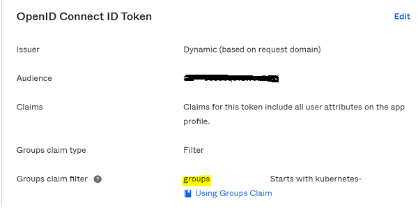

# GKE Okta OIDC configuration 
GKE supports external identity provider to authenticate kubernetes cluster. This readme file is about how to configure 
external identity provider to GKE. By default, GCP Identity and Access Management (IAM) is configured as the identity
provider for cluster authentication. Here we are going to use OKTA OIDC identity as third-party identity providers.

**Steps to be followed:-**

1. Create directory objects such as people and groups in okta admin console.
2. Create an OIDC App in your okta domain.
    ```
   Applications-> Create App Integration -> Sign-in method as "OIDC - OpenID Connect" -> Application type as "Web application"
   -> Enable all grant type i.e. interaction code, refresh token, Implicit
   -> Add Sign-in redirect URIs as http://localhost:8000, http://localhost:18000, http://localhost:18000/callback
   -> save and create OIDC app
   -> Go to that particular Application and add group assignments so that members of group will have access to the application
   -> Inside Sign-On -> OpenID Connect ID Token, edit the section to add group claim with Groups claim filter.
   ```
   
3. Make a note of client id of the application and issuer uri by making this api call.
   ```
   https://<okta-domain>/.well-known/openid-configuration?client_id=<client_id>
   ```
4. Login to gcloud cli using "gcloud init" and set the required gcp project.
5. Enable identity provider using this command: 
   ```
   gcloud container clusters update <CLUSTER_NAME> --enable-identity-service
   ```
6. Download an update default clientConfig:
   ```
   kubectl get clientconfig default -n kube-public -o yaml > client-config.yaml
   ```
7. Update the spec.authentication section with your preferred settings
   ```
   spec:
   name: cluster-name
   server: https://192.168.0.1:6443
   authentication:
   - name: oidc
     oidc:
       clientID: <OIDC_clientID>
       issuerURI: <issuerURI>
       cloudConsoleRedirectURI: https://console.cloud.google.com/kubernetes/oidc
       kubectlRedirectURI: http://localhost:18000/callback
       scopes: openid, email, offline_access, groups
       userClaim: email
       groupsClaim: groups 
       # this should match group claim name defined in okta App(see the screenshot from step 2)
       groupPrefix: okta-
   ```
8. Apply the updated configuration.
   ```
   kubectl apply -f client-config.yaml
   ```
9. Create clusterRole and roleBinding based on okta groups (samples present in same directory)
   ```
   kubectl apply -f <role/rolebinding>.yaml
   ```
10. Once configuration is done, get jwt/Bearer token using AuthN and AuthZ calls to Okta
    ```
    curl --location --request POST 'https://<okta-domain>/api/v1/authn' \
    --header 'Content-Type: application/json' \
    --data-raw '{
     "username": "test-user@sample.com",
     "password": "*******"
    }'
    ```
    It will return sessionToken for the authenticated user, then use that token to get ID_token
    ```
    curl --location --request GET 'https://<okta-domain>/oauth2/v1/authorize?client_id=<>&response_type=id_token&response_mode=form_post&sessionToken=<>&redirect_uri=http://localhost:8000&scope=openid email groups&state=mystate&nonce={guid}'
    ```
    It will return id_token which will be used as user/group claim to authenticate to GKE `gke-oidc-envoy LoadBalancer (endpoint for OIDC requests)`

11. Get OIDC requests endpoint.
   ```
   kubectl get services -n anthos-identity-service gke-oidc-envoy
   ```

12. Make API calls to the GKE 
   ```
   curl --location --request GET 'https://<gke-oidc-envoy-external-IP>:443/api/v1/nodes' \
   --header 'Authorization: Bearer <token>
   ```
   OR
   ```
   kubectl get nodes --token=<id_token> --server=https://<gke-oidc-envoy-external-IP>:443
   ```